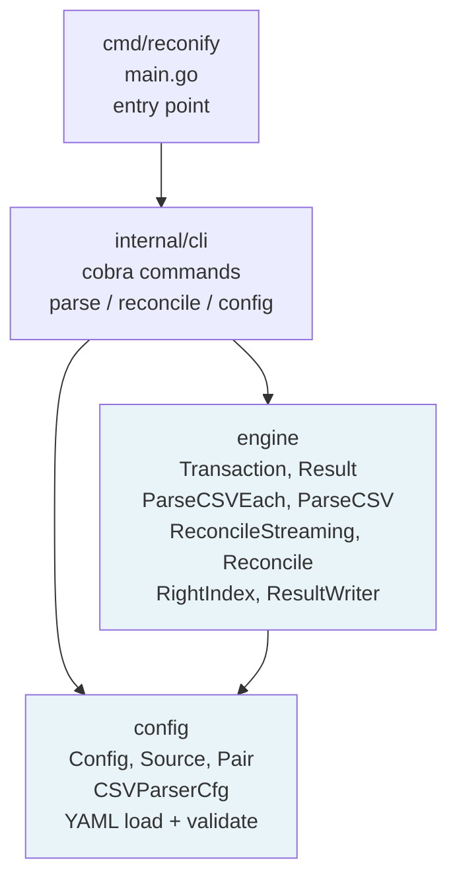
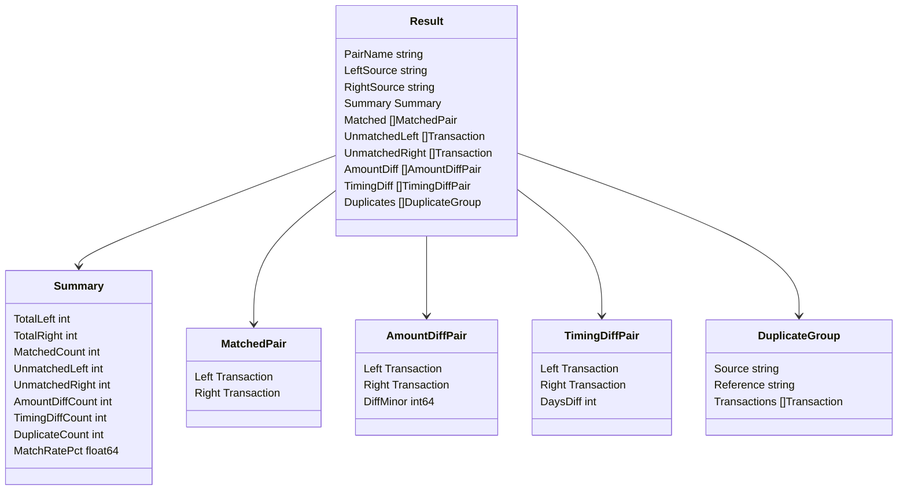
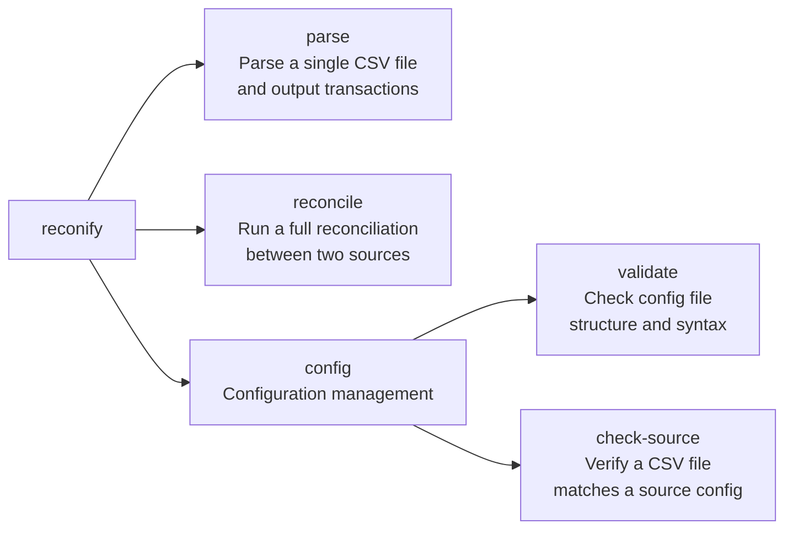
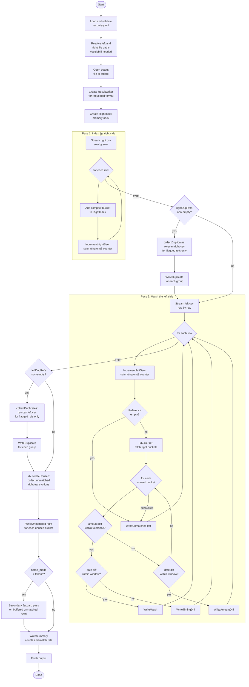
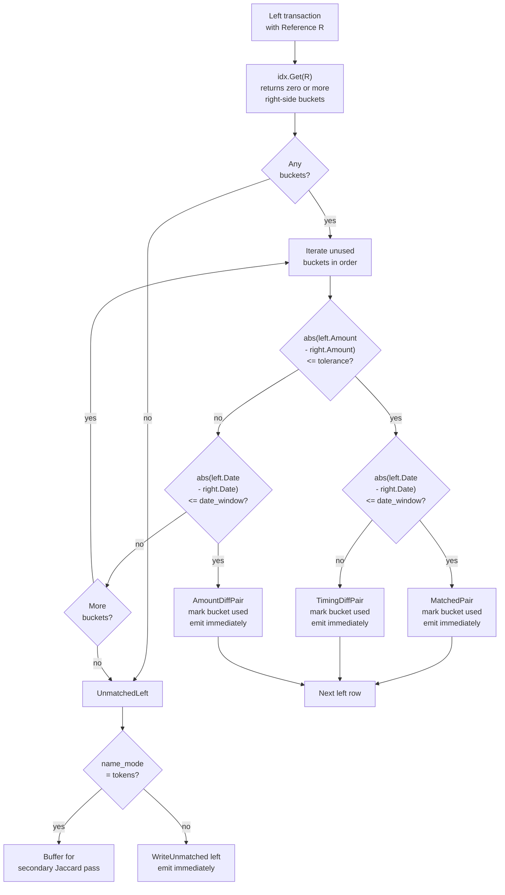
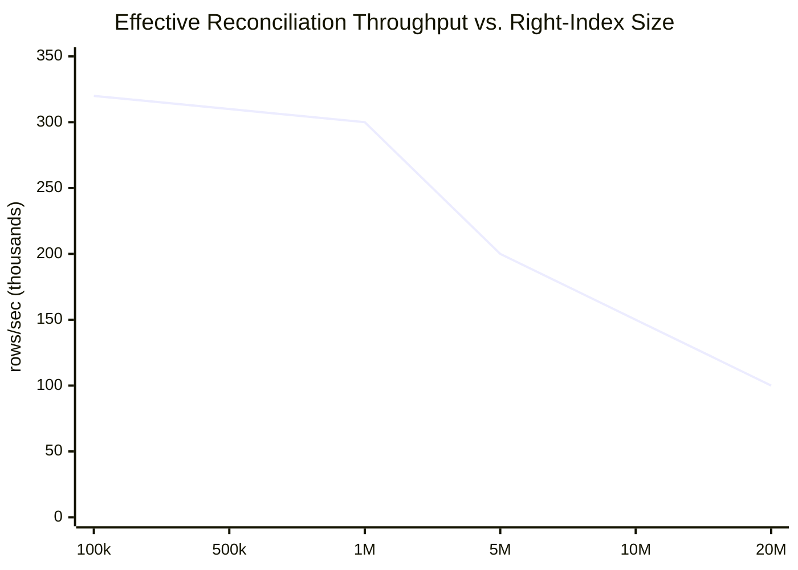
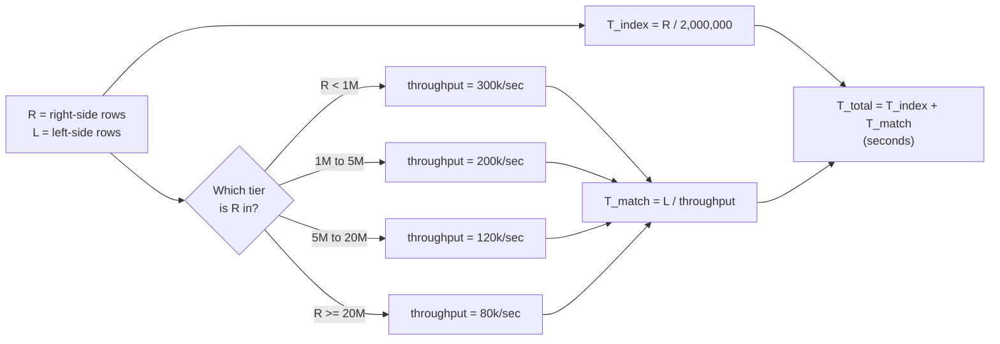

# Reconify Architecture

This document is the primary technical reference for the Reconify open-source
project. It covers the package structure, configuration system, data model, CLI
commands, reconciliation algorithm, output formats, performance characteristics,
and a formula for estimating how long a reconciliation run will take.

---

## Table of Contents

1. [Repository Layout](#repository-layout)
2. [Package Architecture](#package-architecture)
3. [Configuration System](#configuration-system)
4. [Data Model](#data-model)
5. [CLI Commands](#cli-commands)
6. [Reconciliation Flow](#reconciliation-flow)
7. [Matching Algorithm](#matching-algorithm)
8. [Output Formats](#output-formats)
9. [Performance and Time Estimation](#performance-and-time-estimation)
10. [Using the Engine as a Go Library](#using-the-engine-as-a-go-library)

---

## Repository Layout

```
reconify/
├── cmd/reconify/          Entry point: wires cobra root command
├── config/                Public package: Config, Source, Pair, CSVParserCfg
├── engine/                Public package: parser, reconciler, index, types, formats
│   ├── transaction.go     Transaction, Result, and event types
│   ├── parser.go          ParseCSV (batch) and ParseCSVEach (streaming)
│   ├── reconciler.go      Reconcile (batch) and ReconcileStreaming
│   ├── index.go           RightIndex interface and memoryIndex implementation
│   └── format.go          ResultWriter interface and five output format writers
├── internal/cli/          CLI commands: parse, reconcile, config
├── docs/
│   ├── engine/            Original engine algorithm reference
│   ├── performance/       Benchmark results and hardware sizing guide
│   └── ARCHITECTURE.md    This document
├── examples/              Sample reconify.yaml configuration
├── scripts/               Benchmark tooling and data generators
└── testdata/              Placeholder for test fixtures
```

---

## Package Architecture



The `config` and `engine` packages are public. Any Go program can import them
directly without going through the CLI. The CLI (`internal/cli`) is a thin
orchestration layer: it loads config, resolves file paths, wires up a
`RightIndex` and a `ResultWriter`, and hands off to `ReconcileStreaming`.

---

## Configuration System

Configuration lives in a YAML file, by convention named `reconify.yaml`. It is
loaded by `config.Load(path)` and validated by `cfg.Validate()`, which returns a
slice of errors (one per violation).

### Full schema

```yaml
version: 1                  # must be 1
timezone: "UTC"             # optional; IANA timezone for display purposes

sources:
  <source-name>:
    file_pattern: "data/bank/*.csv"   # glob pattern or direct path
    parser:
      type: csv                       # only "csv" is supported currently
      date_col: "Date"                # column name; case-insensitive lookup
      date_layout: "2006-01-02"       # Go time layout string
      tz: "UTC"                       # timezone for date parsing; default UTC
      amount_col: "Amount"            # column name for the amount field
      decimal: "."                    # decimal separator; default "."
      thousands: ","                  # thousands separator; default empty
      multiplier: 100                 # converts to minor units (100 = 2 decimals)
      currency_col: "Currency"        # optional; column for currency code
      name_col: "Description"         # optional; column for merchant/description
      ref_col: "Reference"            # optional; column for payment reference
      skip_raw: false                 # optional; set true on large files to save
                                      # memory by omitting the Raw field

pairs:
  <pair-name>:
    left: bank                        # source name for the left side
    right: stripe                     # source name for the right side
    date_window: "1d"                 # optional; max days between matched dates
    amount_tolerance_minor: 0         # max acceptable amount diff in minor units
    name_mode: "none"                 # "none" or "tokens" (Jaccard secondary pass)
```

### Validation rules

| Field | Rule |
|---|---|
| `version` | Must equal `1` |
| `timezone` | Must be a valid IANA timezone string if provided |
| `sources` | At least one source required |
| `parser.type` | Must be `"csv"` |
| `parser.date_col`, `date_layout`, `amount_col` | Required |
| `parser.multiplier` | Must be greater than 0 |
| `parser.decimal` / `thousands` | Single character each; cannot be equal |
| `parser.tz` | Must be a valid IANA timezone string if provided |
| `pairs.left` / `right` | Must reference an existing source name |
| `pairs.left` != `pairs.right` | A source cannot be compared against itself |
| `pairs.date_window` | Format `Nd` where N is a positive integer (e.g. `"3d"`) |
| `pairs.amount_tolerance_minor` | Must be >= 0 |
| `pairs.name_mode` | Must be `"none"` or `"tokens"` |

### Amount normalization

All amounts are stored in **minor units** (integer). A multiplier of `100`
converts decimal currency strings to cents or kobo. Stripe exports amounts already
in minor units: use `multiplier: 1`. Parenthetical negatives are supported:
`(1,234.56)` is parsed as `-123456`.

---

## Data Model

### Transaction

Every record parsed from any source is normalized into a `Transaction`:

```go
type Transaction struct {
    ID        string            // "{source}-{row}", e.g. "bank-1"
    Date      time.Time         // parsed using date_col + date_layout + tz
    Amount    int64             // always in minor units
    Currency  string            // from currency_col, or empty string
    Reference string            // from ref_col, or empty string
    Name      string            // from name_col, or empty string
    Source    string            // source name from config
    Raw       map[string]string // original CSV row; nil if skip_raw: true
}
```

### Result types



---

## CLI Commands



### `reconify parse`

Parses a single CSV file using the parser configuration for a named source.
Streams parsed transactions to stdout. Useful for debugging column mappings and
date/amount parsing before running a full reconciliation.

```
reconify parse --source <name> --file <path> [--format <fmt>] [--config <path>]
```

| Flag | Default | Description |
|---|---|---|
| `--source` | (required) | Source name as defined in config |
| `--file` | (required) | Path to the CSV file to parse |
| `--format` | `ndjson` | Output format: `ndjson`, `csv`, `table`, `json` |
| `--config` | `reconify.yaml` | Path to the config file |

### `reconify reconcile`

Runs a full reconciliation between the two sources defined in a pair. Streams
results to stdout or a file.

```
reconify reconcile --pair <name> [--out <path>] [--format <fmt>]
                   [--left-file <path>] [--right-file <path>]
                   [--max-token-buffer <n>] [--config <path>]
```

| Flag | Default | Description |
|---|---|---|
| `--pair` | (required) | Pair name as defined in config |
| `--out` / `-o` | stdout | Output file path; use `-` for stdout |
| `--format` | `json` | Output format: `json`, `json-stream`, `ndjson`, `csv`, `table` |
| `--left-file` | (from config glob) | Override left source file path |
| `--right-file` | (from config glob) | Override right source file path |
| `--max-token-buffer` | `100000` | Advisory row limit for token-mode buffer; `0` = unlimited |
| `--config` | `reconify.yaml` | Path to the config file |

### `reconify config validate`

Loads the config file and reports all validation errors. Exits with code 0 on
success, non-zero if any error is found.

```
reconify config validate [--config <path>]
```

### `reconify config check-source`

Checks that a CSV file's columns match the parser configuration for a source.
Currently reports a stub warning; implementation is pending.

```
reconify config check-source --source <name> --file <path> [--config <path>]
```

---

## Reconciliation Flow

The engine runs in streaming mode by default. Memory grows with the right-side
index, not with both files combined. Results are emitted as events and written
to the output immediately.



### Duplicate detection

Duplicate detection runs during the primary passes using a saturating `uint8`
counter per reference. A count of 2 flags the reference as a duplicate. Full
transaction data is only collected in the conditional third-pass re-scan
(`collectDuplicates`), which targets only the flagged references. For datasets
with no duplicate references this re-scan never runs.

Only the first occurrence of a duplicated reference participates in matching.
Subsequent occurrences are grouped into the `DuplicateGroup` event and emitted
via `WriteDuplicate`.

---

## Matching Algorithm



### Reference matching

The primary matching key is the `Reference` field, which maps to the column
specified by `ref_col` in the parser config. When `ref_col` is not configured,
all transactions on that side have an empty reference and go directly to the
unmatched pool (or the token-match buffer, if `name_mode: tokens`).

Multiple right-side buckets can share the same reference (e.g. installment
payments or batch splits). The engine tries each unused bucket in insertion order
and takes the first one that satisfies both amount and date tolerances.

### Token-mode secondary pass

When `name_mode: tokens`, transactions that remain unmatched after the reference
pass are buffered. After both files are fully processed, the engine runs a
secondary Jaccard similarity pass over the buffered rows. A pair is accepted as a
token match when the Jaccard score across word tokens exceeds 0.5 and the amount
and date tolerances are satisfied.

The token buffer grows with the number of unmatched rows. On large datasets where
most transactions are expected to match by reference, token mode is cheap. On
datasets with many unmatched rows it can use significant memory. The
`--max-token-buffer` flag emits a warning (to stderr) when the buffer exceeds the
configured advisory limit.

---

## Output Formats

Both `parse` and `reconcile` support multiple output formats via `--format`.

### `reconcile` formats

| Format | Memory | Description |
|---|---|---|
| `json` | O(results) | Indented JSON object; accumulates all results before writing. Default. |
| `json-stream` | O(1) | Same JSON object shape as `json` but each section is encoded as events arrive. Lower GC pressure for large files. Output may be incomplete if the process is interrupted. |
| `ndjson` | O(1) | One JSON line per event, tagged with `"type"`. Crash-safe; every line is a valid JSON object. Recommended for large files and pipeline consumers. |
| `csv` | O(1) | Fixed-schema CSV with a `type` column. Streaming. |
| `table` | O(results) | Aligned ASCII table. Intended for terminal inspection of small datasets. Warns at 10k rows. |

### `parse` formats

| Format | Memory | Description |
|---|---|---|
| `ndjson` | O(1) | One JSON transaction per line. Default. |
| `csv` | O(1) | CSV rows with header `id,date,amount_minor,currency,reference,name,source`. |
| `table` | O(rows) | Aligned ASCII table. |
| `json` | O(rows) | JSON array of all transactions. |

### NDJSON event types

When using `ndjson` format for reconciliation, each line is a JSON object with a
`"type"` field:

| Type | Payload fields |
|---|---|
| `matched` | `left`, `right` (Transaction objects) |
| `amount_diff` | `left`, `right`, `diff_minor` |
| `timing_diff` | `left`, `right`, `days_diff` |
| `unmatched` | `transaction`, `side` (`"left"` or `"right"`) |
| `duplicate` | `source`, `reference`, `transactions` |
| `summary` | All summary count fields and `match_rate_pct` |

---

## Performance and Time Estimation

### Benchmark environment

All numbers below were measured on an Apple M1 Pro (10-core, 32 GB unified
memory, NVMe SSD), Go 1.24.0, with 20M-row CSV files (~1.23 GB left, ~991 MB
right).

### Throughput reference table

| Stage | Throughput | Notes |
|---|---|---|
| CSV parsing (`ParseCSVEach`) | 2.35M rows/sec | I/O and decode bound; warm OS page cache |
| Reconciliation, right index < 1M | ~300k rows/sec | Index fits in L3 cache; fast lookups |
| Reconciliation, right index 1M-5M | ~200k rows/sec | Partial cache misses begin |
| Reconciliation, right index 5M-20M | ~120k rows/sec | Cache miss rate high; GC pressure rising |
| Reconciliation, right index > 20M | ~80k rows/sec | Fully GC-bound; mark phase dominates |



### Time estimation formula

```
T_seconds = T_index + T_match
```

Where:

```
T_index = R / 2_000_000                 (index right side: parse + store)
T_match = L / throughput(R)             (match left side against index)
```

The effective matching throughput depends on how large the right-side index is:

| Right rows (R) | throughput(R) |
|---|---|
| R < 1M | 300,000 rows/sec |
| 1M <= R < 5M | 200,000 rows/sec |
| 5M <= R < 20M | 120,000 rows/sec |
| R >= 20M | 80,000 rows/sec |



**Example: 5M right rows, 5M left rows**

```
T_index = 5_000_000 / 2_000_000 = 2.5 seconds
T_match = 5_000_000 / 200_000  = 25 seconds
T_total = 2.5 + 25             = ~28 seconds
```

**Example: 20M right rows, 20M left rows (measured: 148-171 seconds)**

```
T_index = 20_000_000 / 2_000_000 = 10 seconds
T_match = 20_000_000 / 120_000   = 167 seconds
T_total = 10 + 167               = ~177 seconds    (measured: 148-171s)
```

### Estimation reference table

| Right rows | Left rows | Estimated time | Notes |
|---|---|---|---|
| 100k | 100k | < 2 seconds | Index fits in L3 cache |
| 500k | 500k | ~ 4 seconds | |
| 1M | 1M | ~ 4 seconds | |
| 5M | 5M | ~ 28 seconds | |
| 10M | 10M | ~ 1.4 minutes | |
| 20M | 20M | ~ 3 minutes | Measured: ~2.5 min |
| 50M | 50M | ~ 11 minutes | |
| 100M | 100M | ~ 23 minutes | Requires 64+ GB RAM |

Times assume warm OS page cache and typical field lengths. Cold cache adds
0.5-30 seconds depending on storage type.

### Memory requirements

Peak RAM is dominated by the right-side index. The full sizing formula and
hardware selection guide are in [docs/performance/README.md](performance/README.md).

Quick reference: plan for approximately 300 bytes of RAM per right-side row plus
2 GB of fixed overhead.

```
RAM_GB = ceil( R * 300 / 1_000_000_000 + 2 )
```

| Right rows | Minimum RAM |
|---|---|
| 1M | 4 GB |
| 5M | 4 GB |
| 10M | 8 GB |
| 20M | 16 GB |
| 50M | 32 GB |
| 100M | 64 GB |

---

## Using the Engine as a Go Library

The `engine` and `config` packages are public and carry no CLI dependencies.

### Streaming reconciliation (recommended for large files)

```go
import (
    "context"
    "io"
    "os"

    "github.com/reconify/reconify/config"
    "github.com/reconify/reconify/engine"
)

cfg, _ := config.Load("reconify.yaml")

idx := engine.NewMemoryIndex()
defer idx.Close()

w, _ := engine.NewResultWriter("ndjson", os.Stdout)

err := engine.ReconcileStreaming(
    context.Background(),
    "my_pair",
    "bank",          // left source name
    "stripe",        // right source name
    "bank.csv",      // left file path
    "stripe.csv",    // right file path
    cfg.Sources["bank"].Parser,
    cfg.Sources["stripe"].Parser,
    cfg.Pairs["my_pair"],
    idx,
    w,
    100_000,         // max token buffer rows (advisory)
)
```

### Batch reconciliation (for small files or in-memory use)

```go
left, _  := engine.ParseCSV("bank",   "bank.csv",   cfg.Sources["bank"].Parser)
right, _ := engine.ParseCSV("stripe", "stripe.csv", cfg.Sources["stripe"].Parser)

result, _ := engine.Reconcile(
    "my_pair", "bank", "stripe", left, right, cfg.Pairs["my_pair"],
)

fmt.Printf("Matched: %d / Match rate: %.2f%%\n",
    result.Summary.MatchedCount, result.Summary.MatchRatePct)
```

### Streaming parser callback

```go
err := engine.ParseCSVEach(
    context.Background(),
    "bank",
    "bank.csv",
    cfg.Sources["bank"].Parser,
    func(tx engine.Transaction, rowIndex int) error {
        fmt.Printf("row %d: %s %d %s\n", rowIndex, tx.Reference, tx.Amount, tx.Currency)
        return nil
    },
)
```

### Custom RightIndex

To handle right-side files that exceed available RAM, implement the `RightIndex`
interface and pass it to `ReconcileStreaming`:

```go
type RightIndex interface {
    Add(tx engine.Transaction) error
    Get(ref string) []*bucket          // returns pointer slice for in-place marking
    IterateUnused(fn func(tx engine.Transaction) error) error
    Close() error
}
```

`ReconcileStreaming` is fully decoupled from the index implementation. A
SQLite-backed, mmap-backed, or remote index can be substituted without changing
the reconciler.
