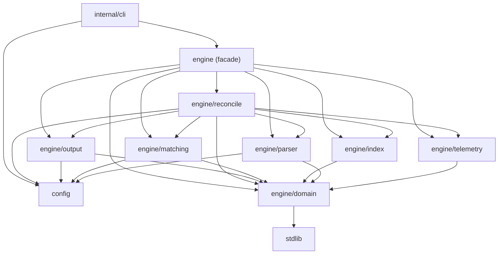

# Engine packages

`engine` remains the public compatibility facade used by the CLI and library
consumers. Implementation responsibilities live in focused sub-packages. The
facade uses aliases and forwarding functions, so existing `engine` imports stay
source-compatible.

`make dep-check` prevents implementation sub-packages from importing the
facade or CLI, preserving the one-way graph.

For the partitioned worker queue, chunk lifecycle, concurrency controls, and
correctness invariants, see [Partitioned parallel reconciliation](./partitioned-parallelism.md).

## Test ownership and filenames

Tests live beside the package that owns the behavior. For a narrow
implementation unit, use a direct filename pair: `filename.go` and
`filename_test.go`. Current examples include:

- `engine/domain/arithmetic.go` and `arithmetic_test.go`
- `engine/index/index_disk.go` and `index_disk_test.go`
- `engine/output/filter.go` and `filter_test.go`
- `engine/reconcile/audit.go` and `audit_test.go`

Do not force a one-to-one filename pairing for tests that intentionally span a
package boundary within the same responsibility. `parser_test.go` covers parser
dispatch and all input formats; `format_test.go` covers every output writer;
and the reconciliation package retains behavior suites for passes, partitioned
runs, multi-source runs, telemetry workflows, and result parity. The test name
should describe the behavior under test, not merely one implementation file.

Shared fixtures remain package-local in `test_helpers_test.go`; they must not
become production helpers or a cross-package `common` test package.
