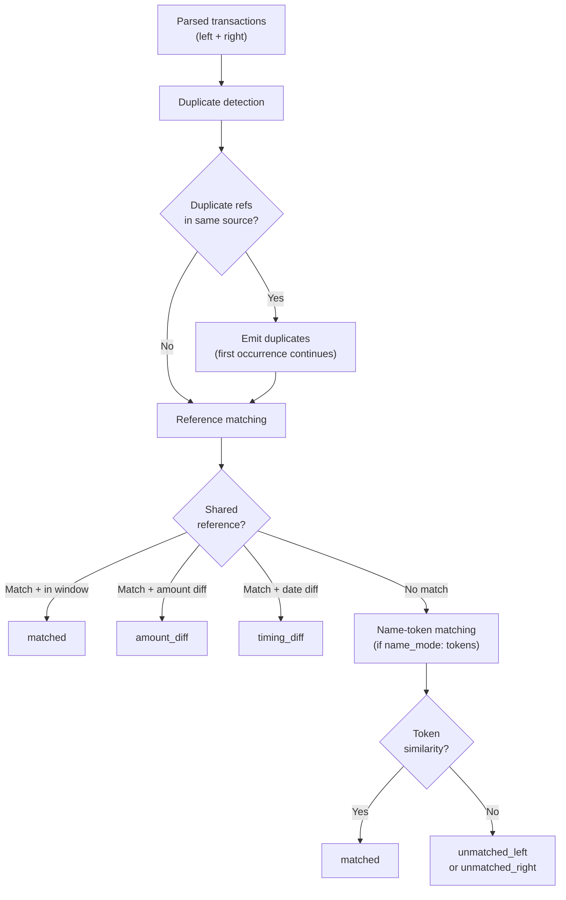

Reconify applies matching in tiers. Earlier matches are removed from later consideration.

## Duplicate detection

Transactions in the same source with the same non-empty reference are grouped as duplicates. Only the first occurrence participates in matching.

Empty references are never grouped as duplicates.

## Reference matching

Reference matching is the primary path. When a left and right transaction share the same reference:

- They are `matched` when amount and date are within the configured rules.
- They are `amount_diff` when the date is acceptable but the amount exceeds tolerance.
- They are `timing_diff` when the amount is acceptable but the date is outside the date window.

## Name-token matching

Set `name_mode: "tokens"` to compare remaining unmatched transactions by token similarity on `Name`.

Token matching applies only after reference matching. It cannot override a reference match.

## Unmatched rows

Rows that do not match by reference or name tokens are emitted as:

- `unmatched_left`
- `unmatched_right`

These represent entries present on one side but not reconciled to the other side.
