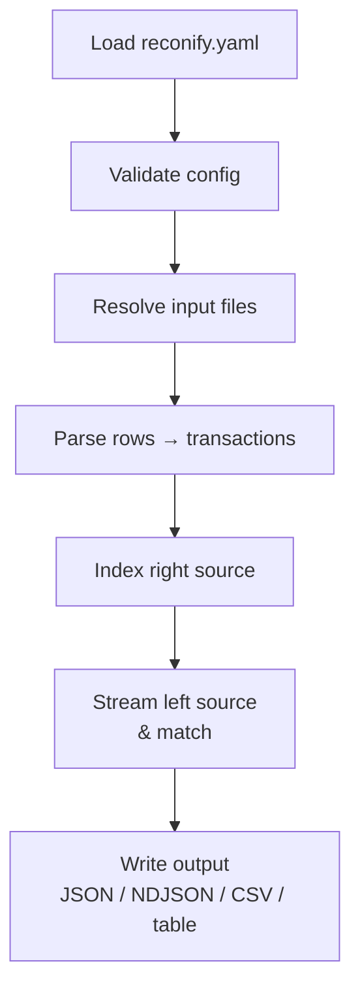

Reconify has four core concepts:

- **Sources** describe input files and parser settings.
- **Parsers** map source-specific columns into normalized transactions.
- **Pairs** define which two sources to compare and which matching rules to apply.
- **Outputs** report matches, differences, duplicates, unmatched rows, and summary totals.

## Data flow

1. Reconify loads `reconify.yaml`.
2. It validates config shape and source references.
3. It resolves input files from explicit flags or source glob patterns.
4. It parses rows into normalized transactions.
5. It builds an index for the right source.
6. It streams the left source and emits reconciliation events.
7. It writes output as JSON, streaming JSON, NDJSON, CSV, or table.

## Where to configure behavior

Parsing behavior belongs under `sources.<name>.parser`.

Matching behavior belongs under `pairs.<name>`.

Large-file memory behavior belongs under `index`.
