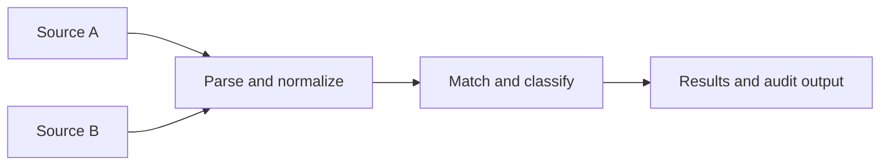

Reconify compares two transaction sources, explains what matched and what did not, and produces machine-readable results for reconciliation systems and finance workflows.

## Choose your path

<Cards>
  <Card title="Run the CLI" href="/docs/cli/quickstart" description="Install Reconify, configure two files, and run your first reconciliation." />
  <Card title="Understand matching" href="/docs/cli/concepts/matching" description="Learn how references, dates, amounts, duplicates, and token matching produce outcomes." />
  <Card title="Choose a use case" href="/docs/cli/mini-guides/use-cases" description="Build bank, PSP, ledger, and payout reconciliation workflows." />
</Cards>

## The reconciliation model

Use the CLI for local files and batch jobs. The pages in this section explain the engine behavior needed to configure, run, and troubleshoot those workflows.

<Callout type="info" title="Production-safe documentation">
  Every guide documents shipped engine and CLI behavior. Start with a real export, validate your mapping, then automate a successful workflow.
</Callout>
