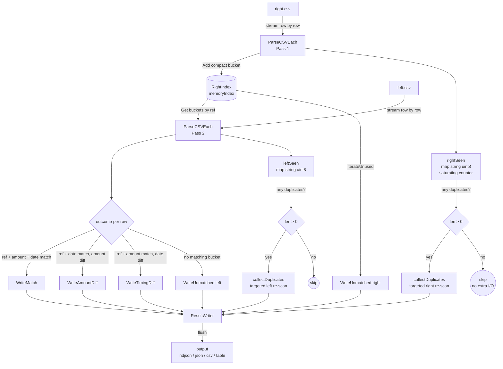
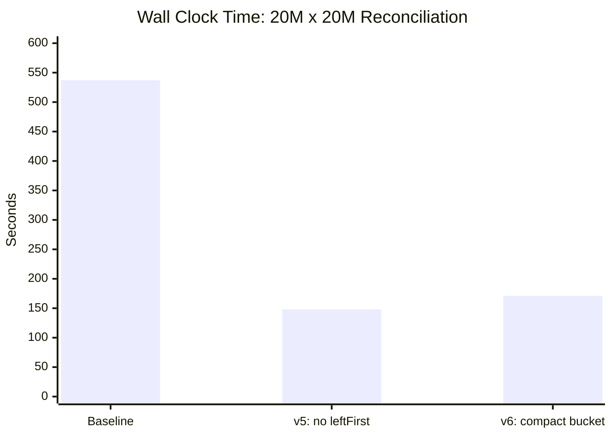
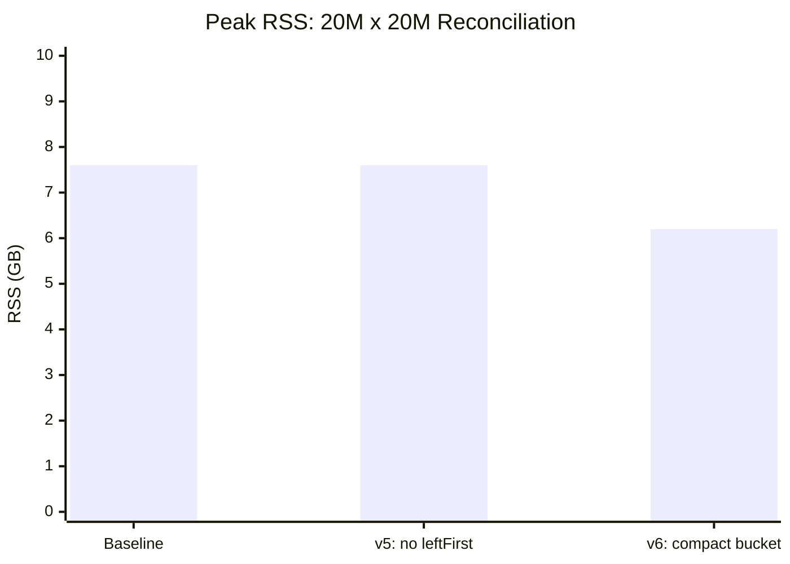
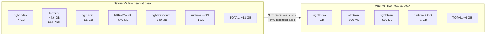
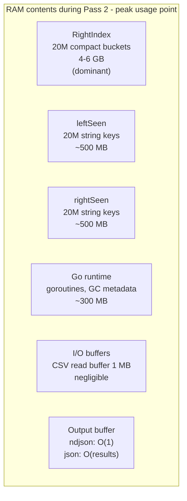
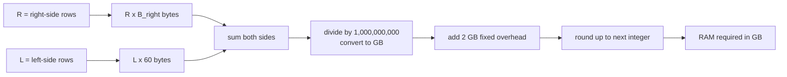
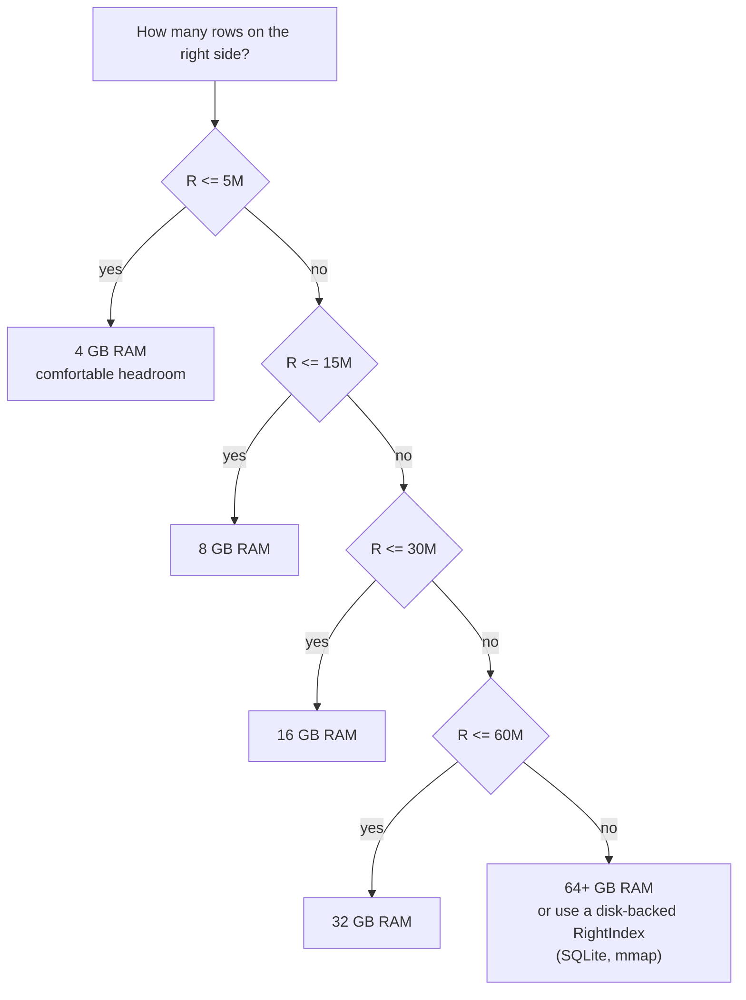

# Reconify Engine Performance

This document explains how the streaming reconciliation engine is designed, what
performance numbers it achieves, why it behaves the way it does at scale, and how
to select hardware for your workload.

---

## How the Engine Works

The reconciler processes two transaction files without loading both into memory
at the same time. The right-side file is indexed once into a hash map. The
left-side file is then streamed and matched against that index row by row. Results
are emitted as events and written to the output format immediately. Peak memory is
determined by the size of the right-side index, not the combined file sizes.



### The three stages

**Stage 1: index the right side.** `ParseCSVEach` streams through `right.csv`.
Each row is stored in the `RightIndex` as a compact `bucket` struct containing flat
integer fields (no `time.Time`, no duplicate reference string). Reference occurrence
counts are tracked using a saturating `uint8` counter capped at 2.

**Stage 2: match the left side.** `ParseCSVEach` streams through `left.csv`. For
each row the engine calls `idx.Get(ref)` for an O(1) bucket lookup. Matches, amount
diffs, timing diffs, and unmatched left rows are emitted immediately to the
`ResultWriter`. Left reference counts are tracked with the same saturating counter.

**Stage 3 (conditional): collect duplicates.** If any reference appeared more than
once on either side, the engine re-scans that file a second time and collects only
the rows whose reference was flagged. For datasets with no duplicates this stage is
never invoked and costs zero I/O.

The `ResultWriter` supports five output formats. `ndjson` and `csv` write one line
per event and use O(1) memory regardless of result size. `json` accumulates all
results in memory before flushing and is intended for smaller datasets or API
integration.

### Observing a live run

For unattended large-file jobs, write telemetry separately from the reconciliation
result:

```bash
reconify reconcile --config reconify.yaml --pair bank_vs_stripe \
  --format ndjson --out results.ndjson \
  --progress-out progress.ndjson --heartbeat-every 30s
```

`progress.ndjson` receives lifecycle events while `results.ndjson` keeps only
reconciliation data. The stream includes rows/sec and elapsed time; totals and
ETA remain absent when obtaining them would add a full scan. RSS/CPU are
best-effort platform metrics, while heap and GC counters are available from the
Go runtime. A telemetry sink failure does not interrupt the reconciliation.

### Bounded-memory partitioning

For a large CSV one-to-one reconciliation, select the partitioned backend:

```yaml
index:
  backend: partitioned
  partition_count: 64
```

Reconify first hashes the reference value in both inputs and writes each row to
one of `partition_count` temporary files. It then repeats the normal streaming
reconciliation for each partition: the right partition is indexed in memory,
the corresponding left partition is streamed, and the temporary index is
released. Equal reference values always select the same partition, so the
matching algorithm remains unchanged while peak memory is bounded by the
largest partition.

`partition_count: 0` uses the default of 32; explicit values must be at least 2.
More partitions reduce memory but increase partition-file overhead and disk
passes. Use `ndjson` or `csv` output so results do not accumulate in memory.

The partitioned backend currently applies only to CSV reference-based
one-to-one pairs with one counterpart. Grouped `one_to_many` and `many_to_many`
passes continue through the existing batch implementation, and multi-source
pairs should use the `memory` or `disk` backend.

### Resource-aware selection

Use resource budgets when file size alone is not a safe proxy for host capacity:

```yaml
index:
  backend: auto
  spill_dir: /var/tmp/reconify
  max_memory_mb: 8192
  max_temp_disk_mb: 16384
```

The selector estimates parsed index memory, SQLite storage, and partition
staging from streamed CSV row shape and file statistics. With a budget set,
`auto` tries memory, then disk, then partitioned indexing. It also checks actual
free space in `spill_dir`. The selected backend and rejected fallback reasons
are included in JSON-style metadata and reported on stderr for CSV/table runs.
Budgets are resource safeguards, not throughput guarantees. If no candidate can
meet its estimate, the run fails explicitly and does not publish final output.

### Grouped settlement passes

The `one_to_many` and `many_to_many` passes are batch-only. They need complete
groups in memory before they can sum amounts, compare group dates, and decide
which rows to consume. The grouping itself is linear in row count, but peak memory
is higher than the streaming 1:1 path because both side groups are held at once.

`many_to_many` does not perform subset-sum or fuzzy combination search. It only
groups rows by an explicit key such as a payout ID, invoice ID, settlement ID, or
payment run ID, then compares the left and right group totals. This keeps the
runtime predictable and the output explainable.

---

## Benchmark Environment

All numbers in this document were collected on an Apple M1 Pro (10-core, 32 GB
unified memory, NVMe SSD) running macOS with Go 1.24.0.

The dataset contains 20 million rows per side, split across two CSV files with
different column schemas (left uses `ref_id`/`description`; right uses
`txn_ref`/`merchant`). File sizes: left.csv ~1.23 GB, right.csv ~991 MB.

The outcome distribution reflects realistic financial reconciliation workloads:

| Outcome | Share |
|---|---|
| Perfect match (ref + amount + date) | 85% |
| Amount difference (1-50 minor units) | 5% |
| Timing difference (1-3 days) | 5% |
| Unmatched left only | 5% |
| Unmatched right only | 5% |

---

## Parse Throughput

Parsing is not the bottleneck. The 1 MB read buffer and a date-string cache (capped
at 1000 keys) keep allocation low and keep `encoding/csv` from dominating.

| Benchmark | Rows | Time | Throughput |
|---|---|---|---|
| `ParseCSVEach` 100k synthetic | 100,000 | ~58 ms | ~1.7 M rows/sec |
| `ParseCSVEach` 20M realistic (warm cache) | 20,000,000 | ~8.5 s | ~2.35 M rows/sec |

These numbers are I/O and CSV-decode bound. They will not improve further without
moving to zero-copy or SIMD-accelerated parsing (a Rust concern, not a Go one).

---

## Reconciliation Throughput Across Optimization Generations





| Version | Wall clock | Peak RSS | Worst GC mark | Approx. rows/sec |
|---|---|---|---|---|
| Baseline | 537 s | 7.6 GB | ~48 s | ~29k |
| v5: eliminate `leftFirst`/`rightFirst` | 148 s | 7.6 GB | ~20 s | ~105k |
| v6: compact `bucket` struct | 171 s | 6.2 GB | ~15 s | ~91k |

The wall-clock numbers have run-to-run variance of roughly 15-20% on macOS due to
thermal throttling and OS scheduling. The RSS measurement is the stable signal.
The v5 to v6 regression in wall-clock time is within that variance band; the RSS
drop from 7.6 GB to 6.2 GB is real and reproducible.

---

## Why Throughput Collapses at 20M Scale

### The engine is not CPU-bound. It is GC-bound.

At 1M rows the right-side index fits largely within L3 cache (typically 8-32 MB on
modern processors). Hash lookups are fast, GC cycles are short, and throughput
reaches ~320k rows/sec.

At 20M rows three effects compound each other.

**Cache miss explosion.** The right-side index grows to 4-6 GB. Every reference
lookup on the left side now misses L3 cache and stalls the CPU waiting for main
memory. This alone reduces throughput by 2-3x compared to the cache-warm case.

**Heap scanning explosion.** Go's garbage collector uses a concurrent tricolor mark
algorithm. During each GC cycle the collector traces every live pointer in the heap.
The duration of the mark phase is proportional to the number of pointer fields in
live objects, not just total heap size. Maps with pointer-rich struct values are the
worst case for this algorithm.

**Mark phase duration.** At baseline the GC took up to 48 seconds for a single
concurrent mark phase at 20M scale. This is not stop-the-world time. The
application continues running while the collector marks. But marking consumes CPU
cores, taking them away from the reconciler and causing the 10x throughput drop from
1M to 20M rows (320k rows/sec down to 29k rows/sec).

### The root cause: `leftFirst map[string]Transaction`

Before any optimization the reconciler stored a full `Transaction` value for every
unique reference seen on the left side:

```
leftFirst  map[string]Transaction   // 20M entries x ~232 bytes = ~4.6 GB
rightFirst map[string]Transaction   // similar, depending on right-side duplication
```

Each `Transaction` held five string fields. Each string is a 16-byte header pointing
to a separate heap allocation. That is approximately 100 million live pointer fields
that the GC had to follow during every collection cycle. This is the 48-second mark
phase.

The critical detail: **both maps were used only for duplicate detection, never for
matching**. The matching algorithm accessed neither `leftFirst` nor `rightFirst`.

---

## Optimization History

### v5: Eliminate `leftFirst` and `rightFirst`

Duplicate detection only needs to know whether a reference appeared more than once,
not what the full transaction looked like. The v5 optimization replaces both large
maps with two small structures per side:

- `leftSeen map[string]uint8`: a saturating counter capped at 2 (0 = unseen, 1 = seen
  once, 2 = seen at least twice)
- `leftDupRefs map[string]bool`: the set of references flagged as duplicates

When duplicates are found, `collectDuplicates` re-scans the file and collects only
the rows whose reference is in `leftDupRefs`. This costs one extra sequential file
read. Sequential I/O on NVMe at 1-2 GB/sec makes this a small fraction of total run
time compared to the GC savings.



Results at 20M x 20M: wall clock 537s to 148s (3.6x), TotalAlloc 43.5 GB to 24.2
GB, worst GC mark 48s to 20s. Peak RSS unchanged at 7.6 GB because the right-side
index still dominated.

### v6: Compact the `bucket` struct

After v5 the right-side index held a full `Transaction` inside each bucket. The
`Transaction` type contained a `time.Time` field (which internally stores a
`*Location` pointer) and a `Reference` string that duplicated the map key. At 20M
entries that was 40 million extra pointer fields in the GC scan graph.

The `bucket` struct was refactored to store flat integer fields only:

```go
type bucket struct {
    id       string
    dateUnix int64   // time.UnixNano() -- no *Location pointer
    amount   int64
    currency string
    name     string
    source   string
    used     bool
}
```

`Reference` is injected from the map key when constructing a `Transaction` for
output via `b.toTransaction(ref)`. `Date` is stored as nanoseconds and reconstructed
via `time.Unix(0, b.dateUnix).UTC()` only at output time. The matching loop caches
`ltx.Date.UnixNano()` once per left row and compares integers:

```go
ltxDateNano := ltx.Date.UnixNano()
daysDiff := daysBetweenNano(ltxDateNano, b.dateUnix)
```

This avoids allocating `time.Duration` and calling `.Hours()` for every bucket
comparison on the hot path.

Results at 20M x 20M: Peak RSS 7.6 GB to 6.2 GB (18% reduction), worst GC mark
20s to 15s.

---

## Memory at Peak During Reconciliation



The right index is the ceiling. The left and right `Seen` maps are substantial but
secondary. Everything else is negligible at 20M scale.

The right index size depends on the average string content in your data. Each bucket
stores four string fields (`id`, `currency`, `name`, `source`). Short identifiers
and three-character currency codes bring the per-bucket cost toward 150 bytes; long
UUIDs and verbose merchant names push it toward 300 bytes. The map structure itself
adds roughly 50-60 bytes per entry regardless.

---

## Hardware Requirements

### RAM formula

The right-side index dominates peak memory. The formula below gives a conservative
estimate for hardware planning:

```
RAM_required_GB = ceil( (R x B_right + L x 60) / 1_000_000_000 + 2.0 )
```

Where:

| Symbol | Meaning |
|---|---|
| `R` | Number of rows in the right-side file |
| `B_right` | Bytes per right-side row in the index (see table below) |
| `L` | Number of rows in the left-side file |
| `60` | Bytes per left-side entry in the `leftSeen` tracking map |
| `2.0 GB` | Fixed overhead: Go runtime, OS buffers, output, safety margin |

`B_right` depends on the average length of the string fields in your data:

| Field profile | `B_right` |
|---|---|
| Short IDs (under 12 chars), 3-char currency codes | 150 |
| Typical (20-char IDs, short descriptions) | 220 |
| Long (UUID IDs, verbose merchant names) | 300 |

For conservative hardware planning use `B_right = 300`.



**Example: 20M right rows, 20M left rows, typical string lengths (B_right = 220)**

```
RAM = ceil( (20_000_000 x 220 + 20_000_000 x 60) / 1_000_000_000 + 2.0 )
    = ceil( (4_400_000_000 + 1_200_000_000) / 1_000_000_000 + 2.0 )
    = ceil( 5.6 + 2.0 )
    = ceil( 7.6 )
    = 8 GB
```

Observed peak RSS in benchmarks: 6.2 GB. The formula over-estimates slightly to
account for Go allocator overhead and GC live-set bookkeeping.

### Reference table



| Right rows | Left rows | B_right=150 | B_right=220 | B_right=300 | Recommended RAM |
|---|---|---|---|---|---|
| 1M | 1M | 0.3 GB | 0.3 GB | 0.4 GB | 4 GB |
| 5M | 5M | 1.1 GB | 1.4 GB | 1.8 GB | 4 GB |
| 10M | 10M | 2.1 GB | 2.8 GB | 3.6 GB | 8 GB |
| 20M | 20M | 4.2 GB | 5.6 GB | 7.2 GB | 16 GB |
| 50M | 50M | 10.5 GB | 14 GB | 18 GB | 32 GB |
| 100M | 100M | 21 GB | 28 GB | 36 GB | 64 GB |

Recommended RAM adds a 2x safety margin over the formula output to account for GC
live-set overhead and OS memory pressure. If the right side does not fit in RAM,
implement `RightIndex` backed by SQLite or a memory-mapped file and pass it to
`ReconcileStreaming`; the reconciler is decoupled from the index implementation.

### CPU

Parsing and reconciliation are single-threaded. A single fast core matters more
than core count. Any modern processor running at 2.5 GHz or above is sufficient.
The current engine does not benefit from additional cores.

### Disk

Input files are read sequentially. The right file is read once per run (twice in
the rare case where duplicate references are detected). No intermediate files are
written.

Sequential read bandwidth at 20M rows (approximately 2.2 GB combined) with a warm
OS page cache is negligible. Cold cache adds approximately:

| Storage type | Additional time |
|---|---|
| NVMe SSD | 0.5 to 2 seconds |
| SATA SSD | 2 to 5 seconds |
| Spinning disk (HDD) | 10 to 30 seconds |

---

## What Comes Next

The remaining pointer density in the right-side index comes from four string fields
per bucket (`id`, `currency`, `name`, `source`). The next optimization levers, in
order of impact, are:

**Currency interning.** Typical datasets contain 3 to 5 distinct currency codes.
Replacing the `currency string` field with a `uint8` enum eliminates one pointer
field per bucket. At 20M rows this saves roughly 200 MB of RSS and removes 20M
pointer fields from the GC scan graph.

**ID lazy reconstruction.** Store only a `rowNum uint32` in the bucket instead of
the `id string`. Reconstruct the ID by seeking to the source row only when
generating output events. This eliminates one more pointer field per bucket but
adds I/O on the output path, so it is only beneficial when the match rate is high
(few unmatched events per total rows processed).

**Hard ceiling in Go.** The practical ceiling for this design in Go is approximately
80 to 120k rows/sec at 20M scale with peak RSS around 4 to 5 GB. Below that floor,
the fundamental cost of 20M hash map entries with string keys and Go's
pointer-tracing GC sets a hard limit that no further struct compaction will break
through. A Rust implementation with arena-allocated structs and no GC would provide
a step-change improvement at that point.
